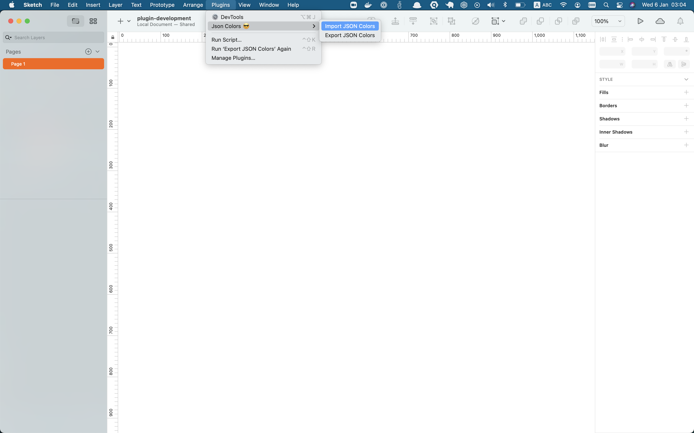
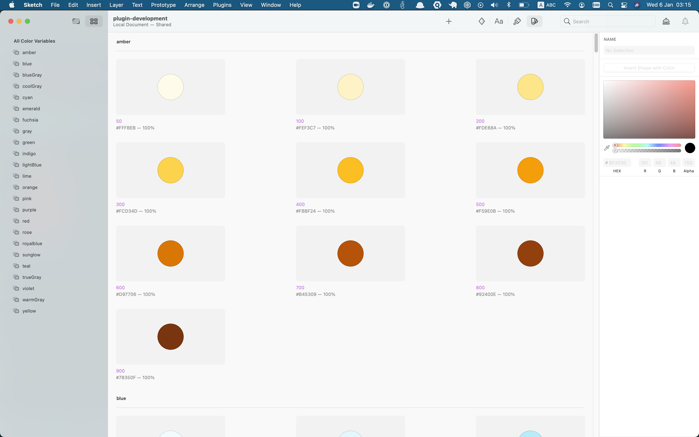

# Json Colors for Sketch.app

This plugin allows you to export and import color pallets to your sketch project using `JSON` format. The aim of this project, is to bridge the gap between design and development in order to have a unified design system. 

## Installation

- [Download](../../releases/latest/download/json-colors.sketchplugin.zip) the latest release of the plugin
- Un-zip
- Double-click on json-colors.sketchplugin

## Usage
- Navigate to the plugins menu in sketch

- For import, make sure to use the colors [file template](/readme/colors.json)
- Sample of imported colors 

